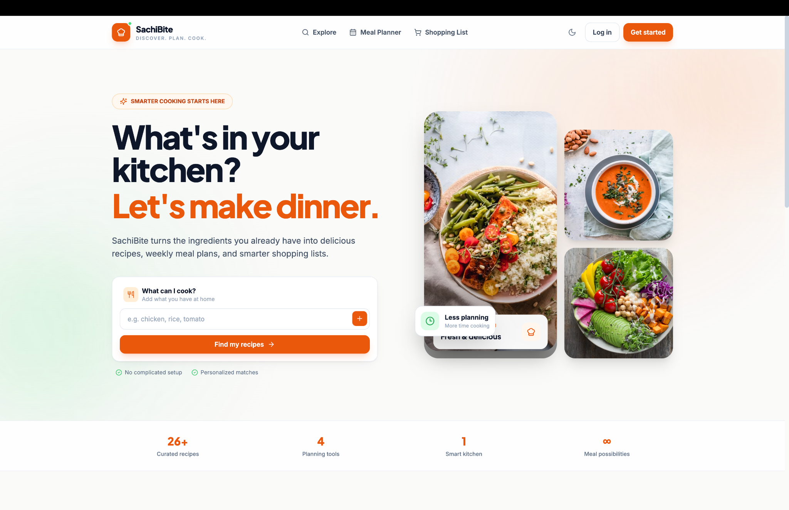
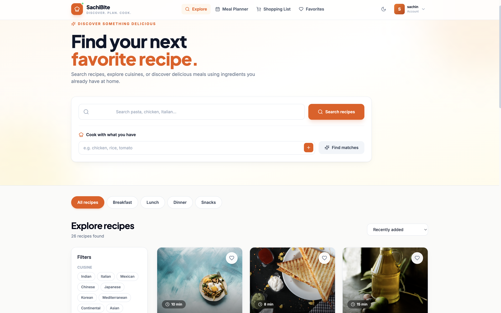
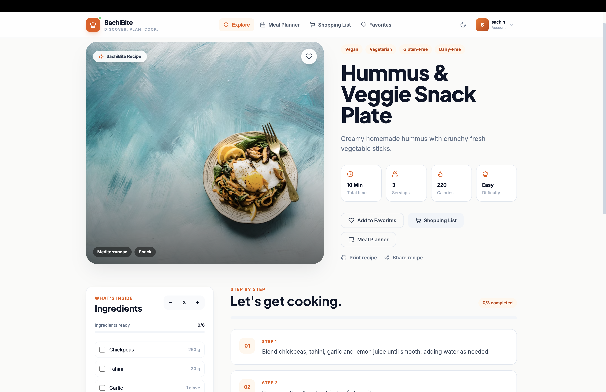
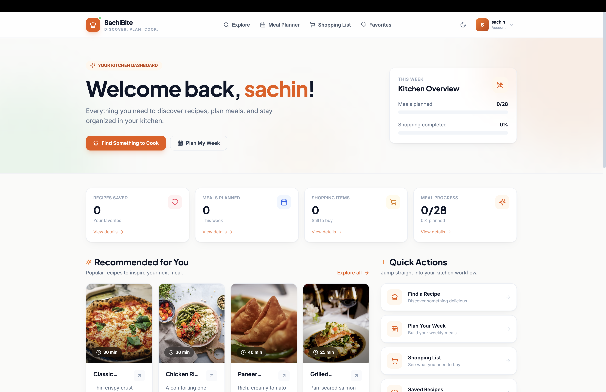
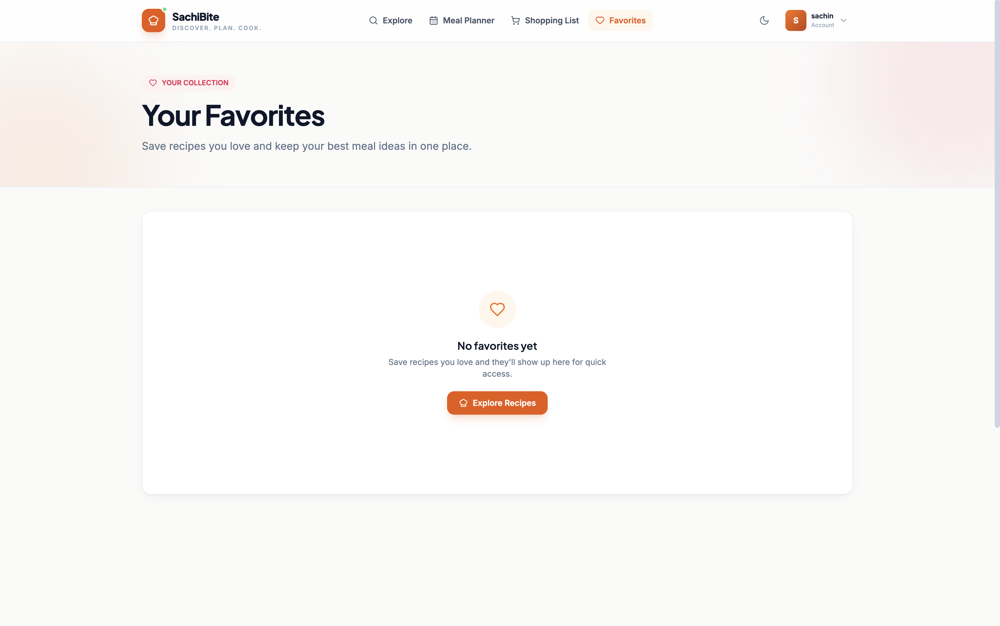
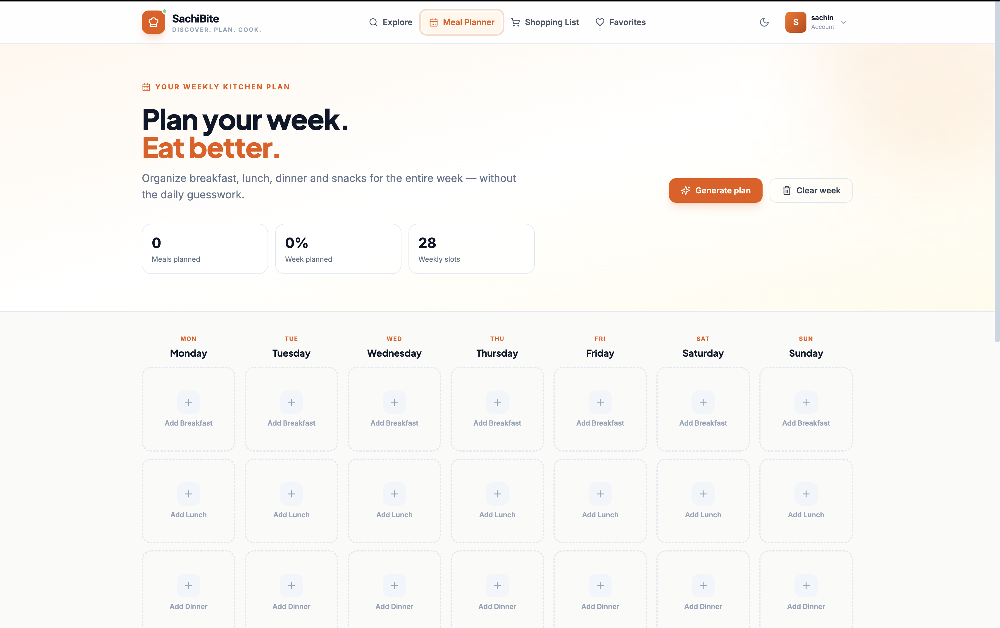
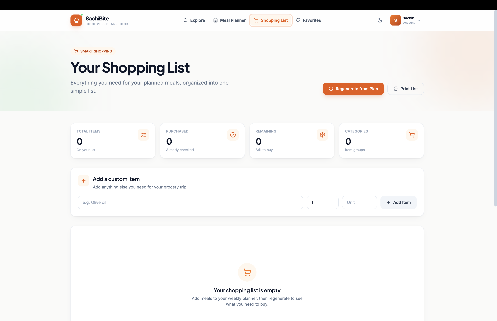

# 🍽️ SachiBite

### Discover. Plan. Cook.

SachiBite is a modern full-stack recipe discovery and meal planning platform designed to make everyday meal planning simple, organized, and enjoyable.

Instead of just finding recipes, SachiBite brings **recipe discovery, favorites, weekly meal planning, and shopping-list management** together in one application.

<div align="center">

### 🍳 Discover Recipes • ❤️ Save Favorites • 📅 Plan Meals • 🛒 Shop Smarter

</div>

---

## 🌟 What is SachiBite?

Planning what to cook can become repetitive and time-consuming.

SachiBite provides a centralized experience where users can:

- 🔎 Discover recipes
- 🥕 Explore meals based on ingredients
- 📖 View detailed recipes
- ❤️ Save favorite recipes
- 📅 Organize weekly meals
- 🛒 Manage shopping ingredients
- 👤 Personalize their experience

The idea is simple:

> **Find something delicious → Plan your meals → Organize your ingredients → Cook with confidence.**

---

# ✨ Core Features

## 🔎 Smart Recipe Discovery

Explore recipes through a clean and responsive interface.

### Features

- Recipe browsing
- Ingredient-based discovery
- Recipe search
- Recipe filtering
- Recipe details
- Cooking information
- Recipe images

---

## ❤️ Favorites

Never lose a recipe you love.

Users can:

- Save recipes
- View saved recipes
- Remove favorites
- Maintain a personalized recipe collection

---

## 📅 Weekly Meal Planner

Turn individual recipes into an organized weekly plan.

Users can:

- Plan meals by day
- Add recipes to their schedule
- Manage planned meals
- Organize their weekly cooking routine

Example:

```text
Monday       → 🍝 Pasta
Tuesday      → 🍛 Curry
Wednesday    → 🥗 Salad
Thursday     → 🍲 Soup
Friday       → 🍕 Pizza
```

---

## 🛒 Shopping List

Meal planning becomes easier when ingredients are organized.

SachiBite provides a dedicated shopping-list system for:

- Adding ingredients
- Removing items
- Managing shopping requirements
- Organizing ingredients needed for meals

---

## 👤 Personalized Experience

Users can manage their profile and preferences through a dedicated profile section.

The application supports:

- User preferences
- Food preferences
- Application settings
- Personalized experience

---

# 🔐 Authentication

SachiBite uses **JWT-based authentication** to protect user-specific functionality.

```text
             ┌───────────────┐
             │     User      │
             └───────┬───────┘
                     │
                     ▼
              Register / Login
                     │
                     ▼
                JWT Token
                     │
                     ▼
          Authenticated Requests
                     │
                     ▼
              Protected APIs
```

Protected areas include:

- Dashboard
- Favorites
- Meal Planner
- Shopping List
- Profile

---

# 🧠 Application Architecture

SachiBite follows a modular full-stack architecture.

```text
                     SACHIBITE
                         │
             ┌───────────┴───────────┐
             │                       │
             ▼                       ▼
       React Frontend          Express Backend
             │                       │
             │                       ├── Routes
             │                       ├── Controllers
             │                       ├── Middleware
             │                       └── Services
             │                       │
             └──────── REST API ─────┘
                                     │
                                     ▼
                               Mongoose ODM
                                     │
                                     ▼
                                  MongoDB
```

---

# 🛠️ Technology Stack

## Frontend


## Backend


## Database & Authentication


## Development Tools


---

# 🧩 Application Modules

| Module | Description |
|---|---|
| 🏠 Home | Product introduction and quick discovery |
| 🔎 Recipes | Browse, search and explore recipes |
| 📖 Recipe Details | Detailed recipe information |
| 📊 Dashboard | Personalized application overview |
| ❤️ Favorites | Save and manage favorite recipes |
| 📅 Meal Planner | Organize weekly meals |
| 🛒 Shopping List | Manage ingredients and shopping items |
| 👤 Profile | Manage preferences and settings |
| 🔐 Authentication | Secure registration and login |

---

# 📁 Project Structure

```text
sachibite/
│
├── backend/
│   │
│   ├── config/
│   │   └── database.js
│   │
│   ├── controllers/
│   │   ├── authController.js
│   │   ├── favoriteController.js
│   │   ├── mealPlanController.js
│   │   ├── recipeController.js
│   │   ├── shoppingListController.js
│   │   └── userController.js
│   │
│   ├── middleware/
│   │   ├── authMiddleware.js
│   │   ├── errorMiddleware.js
│   │   └── validationMiddleware.js
│   │
│   ├── models/
│   │   ├── Favorite.js
│   │   ├── MealPlan.js
│   │   ├── Recipe.js
│   │   ├── ShoppingList.js
│   │   └── User.js
│   │
│   ├── routes/
│   │   ├── authRoutes.js
│   │   ├── favoriteRoutes.js
│   │   ├── mealPlanRoutes.js
│   │   ├── recipeRoutes.js
│   │   ├── shoppingListRoutes.js
│   │   └── userRoutes.js
│   │
│   ├── services/
│   │   ├── mealPlannerService.js
│   │   ├── recipeMatchingService.js
│   │   └── shoppingListService.js
│   │
│   ├── seed/
│   │   ├── seed.js
│   │   └── seedData.js
│   │
│   ├── utils/
│   │   └── generateToken.js
│   │
│   ├── app.js
│   ├── server.js
│   ├── .env.example
│   └── package.json
│
├── frontend/
│   │
│   ├── public/
│   │
│   ├── src/
│   │   ├── components/
│   │   ├── context/
│   │   ├── hooks/
│   │   ├── layouts/
│   │   ├── pages/
│   │   ├── services/
│   │   ├── styles/
│   │   ├── utils/
│   │   ├── App.jsx
│   │   └── main.jsx
│   │
│   ├── index.html
│   ├── package.json
│   ├── tailwind.config.js
│   ├── postcss.config.js
│   ├── vite.config.js
│   └── .env.example
│
├── .gitignore
├── package.json
├── package-lock.json
└── README.md
```

---

# 🚀 Getting Started

## 1. Clone the Repository

```bash
git clone https://github.com/YOUR_USERNAME/sachibite.git
cd sachibite
```

---

## 2. Install Dependencies

### Root Dependencies

```bash
npm install
```

### Backend Dependencies

```bash
cd backend
npm install
```

### Frontend Dependencies

```bash
cd ../frontend
npm install
```

Return to the project root:

```bash
cd ..
```

---

# 🔑 Environment Configuration

## Backend

Create:

```text
backend/.env
```

Example:

```env
PORT=5001
MONGO_URI=mongodb://127.0.0.1:27017/recipe_finder
JWT_SECRET=your_secure_jwt_secret
```

## Frontend

Create the frontend environment file according to:

```text
frontend/.env.example
```

> ⚠️ Never commit real credentials, database passwords, API keys, or JWT secrets to GitHub.

---

# 🗄️ Database Setup

Make sure MongoDB is installed and running locally.

Then seed the recipe database:

```bash
npm run seed
```

This populates the database with the application's recipe data.

---

# ▶️ Running the Application

## Start the Backend

From the project root:

```bash
cd backend
npm run dev
```

Backend API:

```text
http://localhost:5001
```

---

## Start the Frontend

Open a second terminal:

```bash
cd frontend
npm run dev
```

Frontend:

```text
http://localhost:5173
```

The exact URL will be displayed by Vite when the development server starts.

---

# 🔄 User Journey

```text
                 👤 USER
                    │
                    ▼
             🔐 AUTHENTICATION
                    │
                    ▼
               🏠 DASHBOARD
                    │
          ┌─────────┼─────────┐
          │         │         │
          ▼         ▼         ▼
        🔎        ❤️        📅
      Recipes   Favorites   Planner
          │         │         │
          └─────────┼─────────┘
                    │
                    ▼
                   🛒
             Shopping List
```

---

# 📸 Application Screenshots

Add your actual application screenshots to a `screenshots` folder.

Recommended screenshots:

```text
screenshots/
├── home.png
├── recipes.png
├── recipe-details.png
├── dashboard.png
├── favorites.png
├── meal-planner.png
├── shopping-list.png
├── login.png
├── register.png
└── profile.png
```

Then add them to this section:

```markdown
## 📸 Application Preview

### 🏠 Home



### 🔎 Recipe Discovery



### 📖 Recipe Details



### 📊 Dashboard



### ❤️ Favorites



### 📅 Meal Planner



### 🛒 Shopping List


```

---

# 🔌 API Architecture

SachiBite follows a modular REST API architecture.

| API Module | Responsibility |
|---|---|
| Authentication | User registration and login |
| Recipes | Recipe discovery and recipe information |
| Favorites | Save and manage favorite recipes |
| Meal Plans | Create and manage planned meals |
| Shopping List | Manage shopping items |
| Users | Manage user profile and preferences |

The backend separates responsibilities across:

```text
Routes
   ↓
Controllers
   ↓
Services
   ↓
Models
   ↓
MongoDB
```

---

# 🔐 Authentication Flow

SachiBite uses JSON Web Tokens for authentication.

```text
User Registration
       ↓
     Login
       ↓
JWT Token Generated
       ↓
Token Stored Client-Side
       ↓
Authenticated API Request
       ↓
Auth Middleware
       ↓
Protected Resource
```

This architecture allows authenticated users to securely access personalized functionality.

---

# 🧠 Backend Architecture

The backend is organized into separate layers to keep the application maintainable.

### Controllers

Handle incoming requests and application responses.

### Routes

Define REST API endpoints and connect them to controllers.

### Models

Define MongoDB data structures using Mongoose.

### Middleware

Handle authentication, validation, and errors.

### Services

Contain reusable business logic such as:

- Recipe matching
- Meal planning
- Shopping-list operations

### Utilities

Contain reusable helper functions such as JWT generation.

---

# 💡 Technical Highlights

SachiBite demonstrates practical experience with:

- ⚛️ React component architecture
- ⚡ Vite development environment
- 🎨 Responsive UI/UX
- 🌐 REST API integration
- 🟢 Node.js backend development
- 🚂 Express.js API architecture
- 🍃 MongoDB database integration
- 🧩 Mongoose data modeling
- 🔐 JWT authentication
- 🛡️ Protected routes
- 🔧 Express middleware
- 🧠 Service-layer business logic
- 🔎 Recipe matching
- 📅 Meal planning logic
- 🛒 Shopping-list management
- 🌱 Database seeding
- ⚠️ Error handling
- 🌙 Theme support
- 📱 Responsive layouts

---

# 🎯 Project Goals

SachiBite was designed to solve common problems associated with meal planning:

- Difficulty discovering suitable recipes
- Repeatedly searching for meals
- Managing favorite recipes
- Organizing weekly meals
- Keeping track of ingredients
- Managing shopping requirements
- Creating a centralized cooking experience

---

# 🌱 Future Enhancements

Potential future improvements include:

- 🤖 AI-powered recipe recommendations
- 🧠 Personalized meal recommendations
- 🥗 Nutrition and calorie tracking
- 🛍️ Advanced shopping-list automation
- 📱 Progressive Web App support
- 🔔 Meal reminders
- 🌐 Cloud deployment
- 👥 Social recipe sharing
- ⭐ Recipe ratings and reviews

---

# 🏆 Why SachiBite?

SachiBite goes beyond a basic recipe application by connecting the complete meal-planning workflow:

```text
        🔎 DISCOVER
             ↓
        ❤️ SAVE
             ↓
        📅 PLAN
             ↓
        🛒 SHOP
             ↓
         🍳 COOK
```

The project demonstrates how multiple full-stack concepts can work together to create a practical user-focused application.

---

# 📚 What I Learned

Building SachiBite provided practical experience in:

- Designing a full-stack application
- Building REST APIs
- Connecting React with Express
- Working with MongoDB and Mongoose
- Implementing JWT authentication
- Structuring backend applications
- Creating reusable frontend components
- Managing application state
- Handling protected routes
- Implementing business logic
- Designing responsive interfaces
- Debugging frontend/backend integration
- Managing environment variables
- Working with Git and GitHub

---

# 👨‍💻 About

SachiBite is a full-stack project created to demonstrate practical software engineering skills through a real-world application.

The project combines:

```text
Frontend Development
        +
Backend Development
        +
Database Engineering
        +
Authentication
        +
REST APIs
        +
Business Logic
        +
UI/UX Design
```

---

<br>

<div align="center">

## Built with ❤️ and ☕ by

# **Sachin R V**

### MCA Student | Aspiring Software Developer

**Discover. Plan. Cook.**

</div>

---

<div align="center">

⭐ **If you find SachiBite interesting, consider giving the repository a star!**

</div>