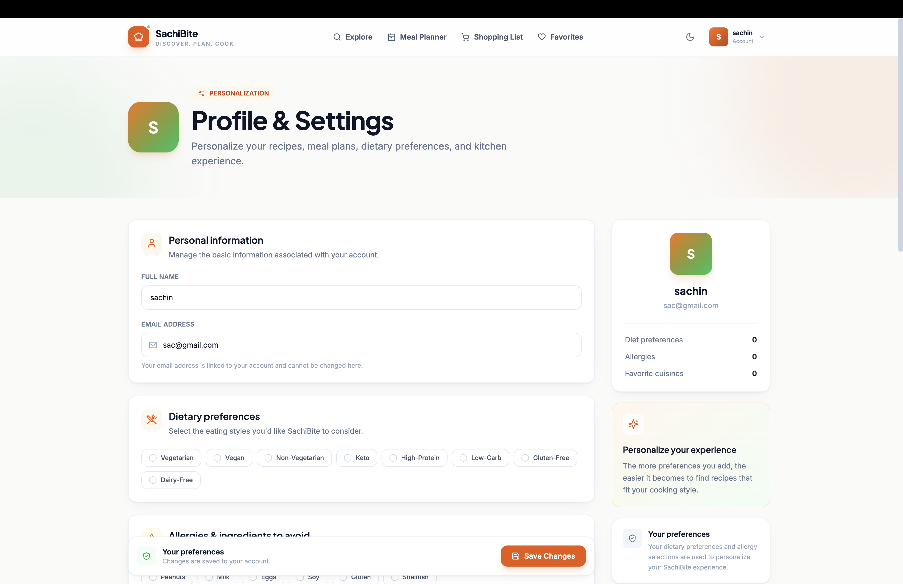
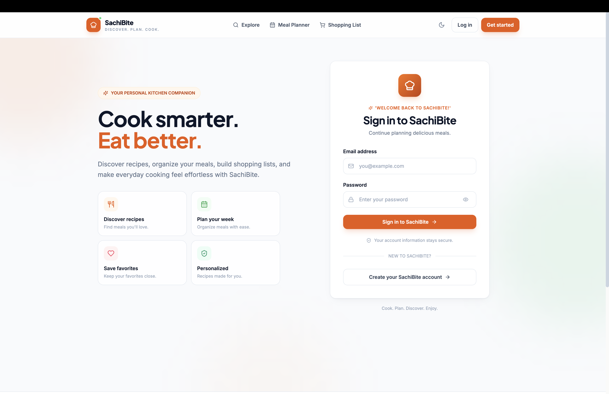
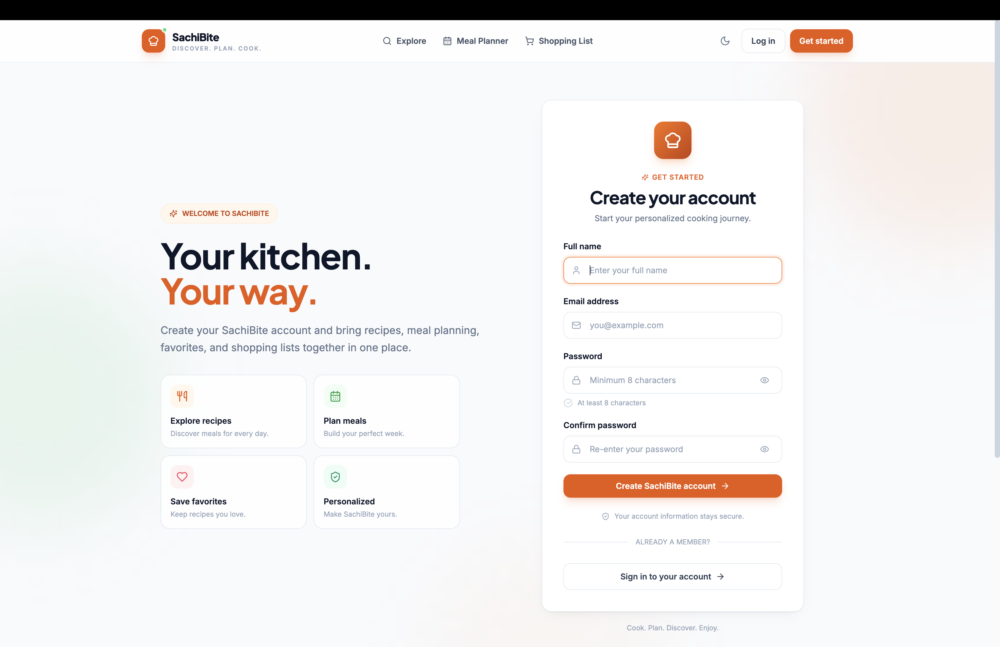

# 🍽️ SachiBite

### Discover. Plan. Cook.

<div align="center">

**A modern full-stack recipe discovery and meal planning platform built to make everyday cooking simpler, smarter, and more organized.**

<br>

[](https://react.dev/)
[](https://vitejs.dev/)
[](https://nodejs.org/)
[](https://expressjs.com/)
[](https://www.mongodb.com/)
[](https://jwt.io/)

</div>

---

## 🌟 What is SachiBite?

**SachiBite** is a full-stack recipe discovery and meal planning application designed to bring the complete cooking-planning workflow into one place.

Instead of simply browsing recipes, users can **discover meals, save favorites, organize weekly meal plans, and manage shopping lists** through a single modern interface.

### The SachiBite workflow

```text
        🔎 DISCOVER
             ↓
        ❤️ SAVE
             ↓
        📅 PLAN
             ↓
        🛒 SHOP
             ↓
         🍳 COOK
```

> **Find something delicious → Plan your meals → Organize your ingredients → Cook with confidence.**

---

# ✨ Core Features

## 🔎 Smart Recipe Discovery

Explore recipes through a clean and responsive interface.

- Browse recipes
- Ingredient-based discovery
- Search recipes
- Filter recipes
- View detailed recipe information
- Recipe images
- Cooking information

---

## ❤️ Favorites

Create a personalized collection of recipes.

- Save favorite recipes
- View saved recipes
- Remove favorites
- Quickly access preferred recipes

---

## 📅 Weekly Meal Planner

Turn individual recipes into an organized weekly cooking schedule.

- Plan meals by day
- Add recipes to specific days
- Manage planned meals
- Organize weekly cooking routines

Example:

```text
Monday       → 🍝 Pasta
Tuesday      → 🍛 Curry
Wednesday    → 🥗 Salad
Thursday     → 🍲 Soup
Friday       → 🍕 Pizza
```

---

## 🛒 Shopping List

Keep track of ingredients required for your meals.

- Add shopping items
- Remove items
- Manage shopping requirements
- Organize ingredients
- Support meal preparation

---

## 👤 Personalized Experience

Manage your preferences and application settings.

- User preferences
- Food preferences
- Profile management
- Application settings
- Personalized experience

---

## 🔐 Secure Authentication

SachiBite uses **JWT-based authentication** to protect user-specific functionality.

```text
Register
   ↓
Login
   ↓
JWT Token
   ↓
Authenticated Request
   ↓
Auth Middleware
   ↓
Protected Resource
```

Protected areas include:

- Dashboard
- Favorites
- Meal Planner
- Shopping List
- Profile

---

# 📸 Application Preview

SachiBite includes a complete user experience across recipe discovery, planning, personalization, and shopping.

## 🏠 Home

<div align="center">


</div>

---

## 🔎 Recipe Discovery

<div align="center">


</div>

---

## 📖 Recipe Details

<div align="center">


</div>

---

## 📊 Dashboard

<div align="center">


</div>

---

## ❤️ Favorites

<div align="center">


</div>

---

## 📅 Meal Planner

<div align="center">


</div>

---

## 🛒 Shopping List

<div align="center">


</div>

---

## 👤 Profile

<div align="center">



</div>

---

## 🔐 Authentication

### Login

<div align="center">



</div>

### Register

<div align="center">



</div>

---

# 🧠 Application Architecture

SachiBite follows a modular full-stack architecture.

```text
                         SACHIBITE
                             │
              ┌──────────────┴──────────────┐
              │                             │
              ▼                             ▼
       React Frontend                 Express Backend
              │                             │
              │                        ┌────┴────┐
              │                        │         │
              │                     Routes   Middleware
              │                        │         │
              │                        ▼         ▼
              │                   Controllers  Auth
              │                        │
              │                        ▼
              │                    Services
              │                        │
              └─────── REST API ───────┘
                                       │
                                       ▼
                                  Mongoose ODM
                                       │
                                       ▼
                                    MongoDB
```

---

# 🛠️ Technology Stack

## Frontend


## Backend


## Database & Authentication


## Development Tools


---

# 🧩 Application Modules

| Module | Description |
|---|---|
| 🏠 Home | Product introduction and recipe discovery |
| 🔎 Recipes | Browse, search and filter recipes |
| 📖 Recipe Details | Detailed recipe information |
| 📊 Dashboard | Personalized application overview |
| ❤️ Favorites | Save and manage favorite recipes |
| 📅 Meal Planner | Organize weekly meals |
| 🛒 Shopping List | Manage ingredients and shopping items |
| 👤 Profile | Manage preferences and settings |
| 🔐 Authentication | Secure registration and login |

---

# 📁 Project Structure

```text
sachibite/
│
├── backend/
│   │
│   ├── config/
│   │   └── database.js
│   │
│   ├── controllers/
│   │   ├── authController.js
│   │   ├── favoriteController.js
│   │   ├── mealPlanController.js
│   │   ├── recipeController.js
│   │   ├── shoppingListController.js
│   │   └── userController.js
│   │
│   ├── middleware/
│   │   ├── authMiddleware.js
│   │   ├── errorMiddleware.js
│   │   └── validationMiddleware.js
│   │
│   ├── models/
│   │   ├── Favorite.js
│   │   ├── MealPlan.js
│   │   ├── Recipe.js
│   │   ├── ShoppingList.js
│   │   └── User.js
│   │
│   ├── routes/
│   │   ├── authRoutes.js
│   │   ├── favoriteRoutes.js
│   │   ├── mealPlanRoutes.js
│   │   ├── recipeRoutes.js
│   │   ├── shoppingListRoutes.js
│   │   └── userRoutes.js
│   │
│   ├── services/
│   │   ├── mealPlannerService.js
│   │   ├── recipeMatchingService.js
│   │   └── shoppingListService.js
│   │
│   ├── seed/
│   │   ├── seed.js
│   │   └── seedData.js
│   │
│   ├── utils/
│   │   └── generateToken.js
│   │
│   ├── app.js
│   ├── server.js
│   ├── .env.example
│   └── package.json
│
├── frontend/
│   │
│   ├── public/
│   │
│   ├── src/
│   │   ├── components/
│   │   ├── context/
│   │   ├── hooks/
│   │   ├── layouts/
│   │   ├── pages/
│   │   ├── services/
│   │   ├── styles/
│   │   ├── utils/
│   │   ├── App.jsx
│   │   └── main.jsx
│   │
│   ├── index.html
│   ├── package.json
│   ├── tailwind.config.js
│   ├── postcss.config.js
│   ├── vite.config.js
│   └── .env.example
│
├── screenshots/
│   ├── dashboard.png
│   ├── favorites.png
│   ├── home.png
│   ├── login.png
│   ├── meal-planner.png
│   ├── profile.png
│   ├── recipe-details.png
│   ├── recipes.png
│   ├── register.png
│   └── shopping-list.png
│
├── .gitignore
├── package.json
├── package-lock.json
└── README.md
```

---

# 🚀 Getting Started

## 1. Clone the Repository

```bash
git clone https://github.com/sachinrv30/sachibite.git
cd sachibite
```

---

## 2. Install Dependencies

### Root Dependencies

```bash
npm install
```

### Backend Dependencies

```bash
cd backend
npm install
```

### Frontend Dependencies

```bash
cd ../frontend
npm install
```

Return to the project root:

```bash
cd ..
```

---

# 🔑 Environment Configuration

## Backend

Create:

```text
backend/.env
```

Add:

```env
PORT=5001
MONGO_URI=mongodb://127.0.0.1:27017/recipe_finder
JWT_SECRET=your_secure_jwt_secret
```

## Frontend

Create the frontend environment file based on:

```text
frontend/.env.example
```

> ⚠️ Never commit real credentials, database passwords, API keys, or JWT secrets to GitHub.

---

# 🗄️ Database Setup

Make sure MongoDB is installed and running locally.

Then seed the recipe database:

```bash
npm run seed
```

The seed process populates the database with recipe data.

---

# ▶️ Running the Application

SachiBite uses three local services:

```text
MongoDB   → 27017
Backend   → 5001
Frontend  → 5173
```

## Start MongoDB

```bash
mongod --config /opt/homebrew/etc/mongod.conf
```

Verify MongoDB:

```bash
mongosh --eval "db.adminCommand({ ping: 1 })"
```

Expected:

```text
{ ok: 1 }
```

---

## Start Backend

Open a new terminal:

```bash
cd backend
npm run dev
```

Backend API:

```text
http://localhost:5001
```

---

## Start Frontend

Open another terminal:

```bash
cd frontend
npm run dev
```

Frontend:

```text
http://localhost:5173
```

Open the URL displayed by Vite.

---

# 🔌 API Architecture

SachiBite follows a modular REST API architecture.

| API Module | Responsibility |
|---|---|
| Authentication | User registration and login |
| Recipes | Recipe discovery and recipe information |
| Favorites | Save and manage favorite recipes |
| Meal Plans | Create and manage planned meals |
| Shopping List | Manage shopping items |
| Users | Manage user profile and preferences |

Backend request flow:

```text
Routes
   ↓
Controllers
   ↓
Services
   ↓
Models
   ↓
MongoDB
```

---

# 🔐 Authentication Flow

SachiBite uses JSON Web Tokens for authentication.

```text
User Registration
       ↓
     Login
       ↓
JWT Token Generated
       ↓
Authenticated Request
       ↓
Auth Middleware
       ↓
Protected Resource
```

This allows authenticated users to access personalized application functionality.

---

# 🧠 Backend Architecture

The backend separates responsibilities into dedicated layers.

### Controllers

Handle incoming requests and application responses.

### Routes

Define REST API endpoints and connect them to controllers.

### Models

Define MongoDB data structures using Mongoose.

### Middleware

Handle authentication, validation, and errors.

### Services

Contain reusable business logic including:

- Recipe matching
- Meal planning
- Shopping-list operations

### Utilities

Provide reusable helper functionality such as JWT generation.

---

# 💡 Technical Highlights

SachiBite demonstrates practical experience with:

- ⚛️ React component architecture
- ⚡ Vite development environment
- 🎨 Responsive UI/UX
- 🌐 REST API integration
- 🟢 Node.js backend development
- 🚂 Express.js API architecture
- 🍃 MongoDB database integration
- 🧩 Mongoose data modeling
- 🔐 JWT authentication
- 🛡️ Protected routes
- 🔧 Express middleware
- 🧠 Service-layer business logic
- 🔎 Recipe matching
- 📅 Meal planning logic
- 🛒 Shopping-list management
- 🌱 Database seeding
- ⚠️ Error handling
- 🌙 Theme support
- 📱 Responsive layouts
- 🔗 Frontend/backend integration

---

# 🎯 Project Goals

SachiBite was designed to address common meal-planning challenges:

- Difficulty discovering suitable recipes
- Repeatedly searching for meals
- Managing favorite recipes
- Organizing weekly meals
- Keeping track of ingredients
- Managing shopping requirements
- Bringing the cooking workflow into one application

---

# 🌱 Future Enhancements

Potential future improvements include:

- 🤖 AI-powered recipe recommendations
- 🧠 Personalized meal recommendations
- 🥗 Nutrition and calorie tracking
- 🛍️ Advanced shopping-list automation
- 📱 Progressive Web App support
- 🔔 Meal reminders
- 🌐 Cloud deployment
- 👥 Social recipe sharing
- ⭐ Recipe ratings and reviews

---

# 🏆 Why SachiBite?

SachiBite connects the complete meal-planning workflow in one application:

```text
        🔎 DISCOVER
             ↓
        ❤️ SAVE
             ↓
        📅 PLAN
             ↓
        🛒 SHOP
             ↓
         🍳 COOK
```

The project combines frontend engineering, backend development, database management, authentication, REST APIs, business logic, and UI/UX into a practical full-stack application.

---

# 📚 What I Learned

Building SachiBite provided practical experience in:

- Designing a full-stack application
- Building REST APIs
- Connecting React with Express
- Working with MongoDB and Mongoose
- Implementing JWT authentication
- Structuring backend applications
- Creating reusable frontend components
- Managing application state
- Handling protected routes
- Implementing business logic
- Designing responsive interfaces
- Debugging frontend/backend integration
- Managing environment variables
- Working with Git and GitHub
- Organizing a production-style project structure

---

# 👨‍💻 About the Developer

SachiBite is a full-stack project created to demonstrate practical software engineering skills through a real-world application.

### Built with

```text
Frontend Development
        +
Backend Development
        +
Database Engineering
        +
Authentication
        +
REST APIs
        +
Business Logic
        +
UI/UX Design
```

---

# 🔗 Project

**GitHub Repository:**  
https://github.com/sachinrv30/sachibite

---

<br>

<div align="center">

## Built with ❤️ and ☕ by

# **Sachin R V**

### MCA Student | Aspiring Software Developer

**Discover. Plan. Cook.**

</div>

---

<div align="center">

⭐ **If you find SachiBite interesting, consider giving the repository a star!**

</div>